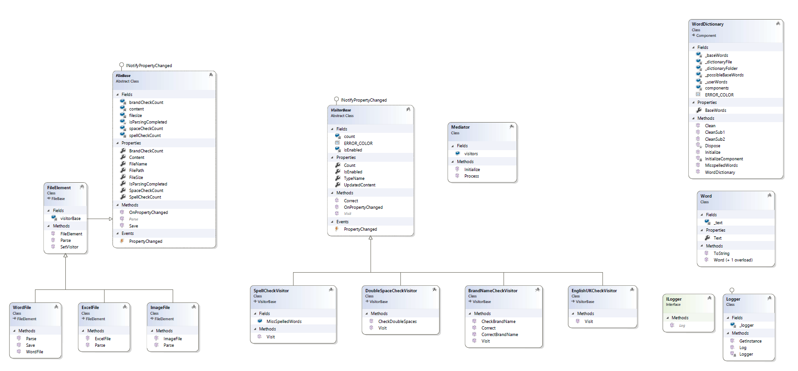

# WPF Desktop App for Document Review System
##### This is a WPF Desktop Application which can be used to process MULTIPLE documents of type **_Word, Excel, Image, Text_** and produce reports for **_Spelling Errors, extra white spaces, typo in brand names, change language from U.K. English to U.S. English, etc_**.

## Class Diagram of the Business Layer: 

## Steps to upload and parse the documents: 
1. Once you've cloned the repo, use Visual Studio to restore necessary NuGet packages.
2. Build Solution and make sure there are no missing NuGet errors. In case of error, make sure NuGet feed is setup to pick from *nuget.org (https://api.nuget.org/v3/index.json)*
3. Make sure DRS_Client is setup as the StartUp project. Run the solution.
4. Browse single or multiple files (_**word**_[doc., .docx], _**excel**_[.xls][.xlsx], _**image**_[.png][.jpg][.jpeg])
5. All the files will be processed asynchronously using Tasks. Once the processing is complete, the report with appropriate counts will be shown in the file list window.
6. Click on Individual file to view detailed report and perform corrections. 
7. Reports supported initially are Spelling Check, Double Space Check & Brand name typo validation.
8. Each of the report shows Count of occurences and a Button to correct the issues. 
9. Correction functionality is only supported for Brand Name typo validation as of now. 

## Patterns used for scalability and robustness: 
1. MVVM architectural pattern for modularizing components.
2. Visitor design pattern for abstracting Logic/Operation (like Spelling Check) from the actual implementation. This pattern will be very useful when we plan to add a new Operation (like Check UK English).
3. Mediator design pattern for centralizing the process of parsing the file and processing individual operations asynchronously using Tasks. Mediator is basically a traffic police in our case abstracting the client from the actual implementation. 
4. Template Method design pattern for having default file implementations.

## Algorithms designed :
### _1. Brand Name Typo Validator_:
This algorithm acts as a customized Regex to identify various edge cases of typo in Brand Names.

### _2. Spelling Mistake Validator_: 
This algorithm checks the mistake in words from a in-house dictionary. Instead of using a 3rd party dictionary or an online dictionary API, I have designed a in-house dictionary with a enormous collection of English words. Benefit of having a in-house dictionary is that we can have Company specific internal words stored in the dictionary. 

### _3. Double Space Validator_: 
This algorithm checks for double spaces occurence in the document. This can be used to remove extra whitespace typos in internal documents.

## Scope for future enhancements :
1. Easy addition of any other type of files because of the File Abstractions. 
2. Easy addition of any additional operation/logic because of Operation Visitor Abstractions.
3. Spell Check operation can be improved further to suggest set of correct words for each incorrect word based on the Phonetic Algorithms. 
4. Virtualization can be used to achieve memory efficiency. 

